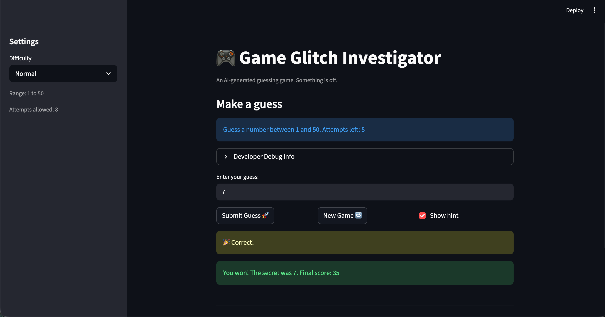

# 🎮 Game Glitch Investigator: The Impossible Guesser

## 🚨 The Situation

You asked an AI to build a simple "Number Guessing Game" using Streamlit.
It wrote the code, ran away, and now the game is unplayable. 

- You can't win.
- The hints lie to you.
- The secret number seems to have commitment issues.

## 🛠️ Setup

1. Install dependencies: `pip install -r requirements.txt`
2. Run the broken app: `python -m streamlit run app.py`

## 🕵️‍♂️ Your Mission

1. **Play the game.** Open the "Developer Debug Info" tab in the app to see the secret number. Try to win.
2. **Find the State Bug.** Why does the secret number change every time you click "Submit"? Ask ChatGPT: *"How do I keep a variable from resetting in Streamlit when I click a button?"*
3. **Fix the Logic.** The hints ("Higher/Lower") are wrong. Fix them.
4. **Refactor & Test.** - Move the logic into `logic_utils.py`.
   - Run `pytest` in your terminal.
   - Keep fixing until all tests pass!

## 📝 Document Your Experience

- [X] Describe the game's purpose.
The purpose of this game is that the player tries to guess a secret number with only 8 attempts.
- [X] Detail which bugs you found.
THe program contained bugs such as:
the hints were wrong
Normal and hard difficulty were swapped.
secret number was a string if the number was even.
new game wouldnt stick to the diffculty for the secret number.
the only range was 1 to 100 despite choosing diffuclty..
new game started at 0 instead of 1
- [X] Explain what fixes you applied.
i set the new game to use low and high instead of 1 to 100.
i removed the conditional making even secret numbers set as strings. i swapped the values for normal and hard in the logic python file. i also moved the code that was in the app python file to the logic file. 

## 📸 Demo

- [X] [Insert a screenshot of your fixed, winning game here]

## 🚀 Stretch Features

